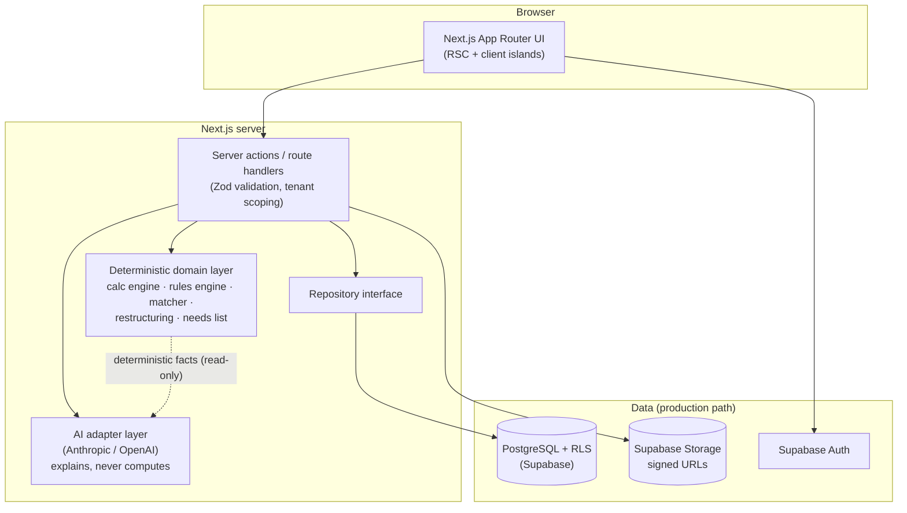
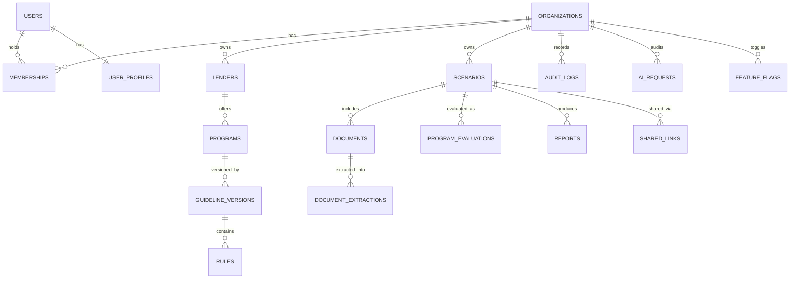

# Architecture

## Repository assessment (Phase 1)

The repository started empty (no prior code, no commits). This is a greenfield build on branch `claude/non-qm-navigator-platform-eb0jhb`.

## Guiding decisions

| Decision | Choice | Rationale |
|---|---|---|
| Eligibility source of truth | Deterministic TypeScript domain layer | Auditable, testable, versionable; AI never invents numeric rules |
| Money math | decimal.js everywhere in `src/domain` | No binary floating-point drift in financial results |
| ORM | **Prisma** (over Drizzle) | Mature migration tooling, typed client, first-class Postgres/Supabase support, larger ecosystem; schema doubles as documentation. Drizzle's lighter runtime was not decisive because the domain layer is DB-free anyway. |
| Persistence | `SupabaseRepository` — real Postgres via Supabase, RLS-scoped per request | Same `Repository` interface a from-scratch in-memory or Python backend could implement without touching the UI; this app runs on the real Prisma-modeled schema, not an in-memory stand-in |
| Rules engine semantics | Ternary (true / false / unknown) | Missing input can never silently pass a rule — it surfaces as manual review |
| Rule activation | Only `human_verified` + inside effective/expiration window | AI-extracted or imported rules can never run without human review |
| AI integration | Provider-agnostic adapter (Anthropic/OpenAI), env-configured | Vendor independence; safety rules enforced in one place |
| Future calc service | Domain layer is pure TS with JSON-serializable inputs/outputs | A Python/FastAPI service can replace it behind the same contracts without UI changes |

## System architecture



Key boundary: **`src/domain` imports nothing from Next.js, React, or the database.** It is pure, synchronous TypeScript operating on typed values — which is what makes the 68-test suite fast and the engine portable.

## Entity-relationship diagram



The app persists scenario/program/rule payloads as typed JSON columns (`data`, `config`, `definition`) with hot fields projected to columns as query needs emerge — a deliberate trade for schema agility while the domain types (in `src/domain/types`) remain the single source of truth. `docs/database.md` covers the full normalization path (scenario_borrowers, scenario_assets, rule_conditions, etc.) for when relational querying of those substructures is required.

## Folder structure

```
src/
  domain/                  # PURE deterministic logic — no framework imports
    money.ts               # decimal-safe arithmetic helpers
    analyze.ts             # top-level pipeline: calc → evaluate → rank → restructure → needs
    types/                 # enums, scenario, program/rule, result types
    calc/                  # ltv, dti, dscr, bankStatement, pnl, assetDepletion, reserves
    rules/                 # context builder, operators, ternary evaluator, effective-date logic
    matching/              # base checks, scoring, program evaluator, restructuring, needs list
    validation/            # shared Zod schemas
  data/                    # seed/sample lenders/programs/rules/scenarios (flagged isSampleData — see docs/sample-data-disclaimer.md; real verified lender data lives in the database, not here)
  lib/
    store.ts               # Repository interface (implemented by SupabaseRepository, real Postgres)
    ai/                    # provider abstraction + explanation feature
  components/              # shared presentational components
  app/                     # Next.js App Router pages, server actions, API routes
prisma/schema.prisma       # production schema (Prisma/PostgreSQL)
supabase/rls-policies.sql  # row-level-security policies
tests/domain/              # calculation, rules, matching + scenario regression tests
docs/                      # this documentation set
```

## Milestone plan and status

| Phase | Scope | Status |
|---|---|---|
| 1 Planning | This document, ERD, risks, assumptions | ✅ |
| 2 Foundation | Next.js + strict TS, Tailwind, CI, test framework, schema + RLS | ✅ |
| 3 Scenario intake | Dynamic questionnaire, validation, server action, list/detail | ✅ |
| 4 Calculation engine | All seven calculations, traced + tested | ✅ |
| 5 Rules & matching | Rules engine, evaluator, ranking, comparison, restructuring | ✅ |
| 6 Administration | Program/lender read views shipped; program builder + publication workflow designed (schema/docs), UI pending | ◐ |
| 7 Reports & AI | Needs list + JSON export shipped; AI adapter + safety layer shipped (disabled without keys); PDF pending | ◐ |
| 8 Hardening | Domain test suite green, build green; production security checklist in docs/security.md | ◐ |

## Major security risks identified

1. **Cross-tenant data leakage** — mitigated by RLS policies + server-side org resolution (client-supplied org IDs are never trusted).
2. **Prompt injection via uploaded documents/notes** — mitigated by instruction/data separation, schema-validated outputs, no tool exposure (docs/ai-safety.md).
3. **AI-invented eligibility rules** — structurally prevented: AI output can only become a *draft* rule requiring human verification before activation.
4. **PII exposure in logs/reports** — policy: anonymized borrower references, no SSNs/account numbers anywhere in the data model.
5. **Stale guidelines presented as current** — every result shows version, effective date, last-verified date; expired rules deactivate automatically.

## Assumptions

- One organization per browsing session in the demo (`org_demo`); production uses Supabase Auth sessions.
- Sample guidelines are structural placeholders — numbers are fictional and labeled as such.
- Reserve calculation counts retirement at a default 70% haircut (configurable per program in production).
- DTI for DSCR programs is intentionally not computed (property-qualified).

## Things that must remain configurable

- LTV basis (lower-of / appraised / price), per organization or program
- Bank-statement expense factor source and floors, per program
- DSCR rent basis and denominator (PITIA/ITIA), per program
- Asset-depletion haircuts, deductions, divisor, per program
- Match-score weights; branding; data-retention windows; AI provider/model
